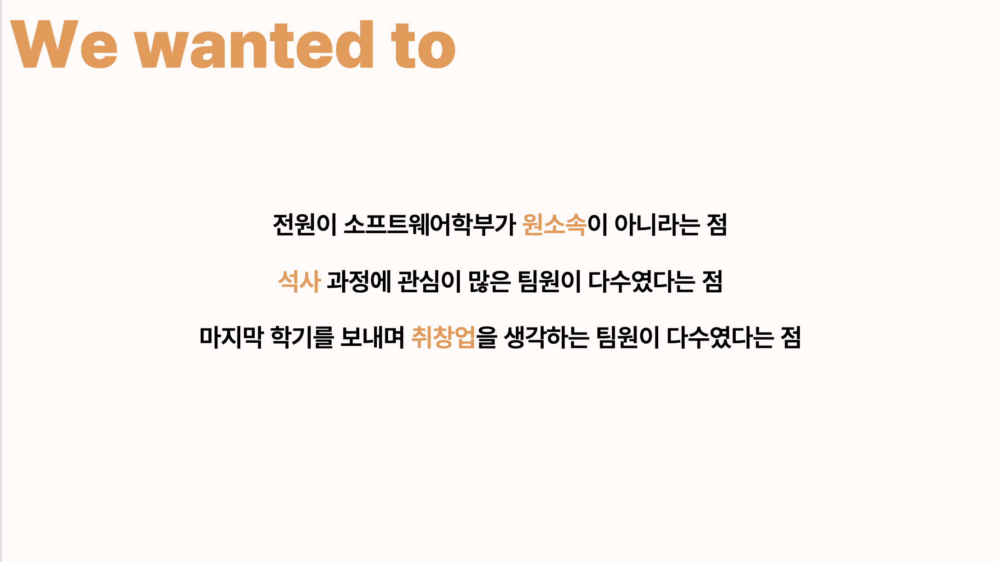

# Hello!

국민대학교 소프트웨어융합대학 소프트웨어학부
'24-02학기 유레카프로젝트 1분반 11조입니다.

- 2016**** 장원재
- 2017**** 심현우
- 2022**** 조윤주
- 2022**** 신윤제
- 2021**** 문지훈

## Breaking out

원소속의 테두리를 뛰어넘어 새로운 도전을 위해 소프트웨어학부에 도전하고 있는
전과, 다/부전공 생들의 유레카 프로젝트입니다.

소프트웨어학부를 조금 더 잘 이해하고, 더 수월한 온보딩을 할 수 있는 방법에는 어떤 것이 있을지,
그리고 졸업 후에는 어떤 진로들이 있을지 알아보려 합니다.

### :one: 공통 관심사 / 특이사항
- 전과/복수전공
- 취업 및 진로
- 학부연구생과 대학원 진학

### :two: 활동내역
- 전부 완료! :100:

### :three: 활동소감

# 즐거웠습니다!

[프레젠테이션 다운로드](./final_presentation.pptx)

