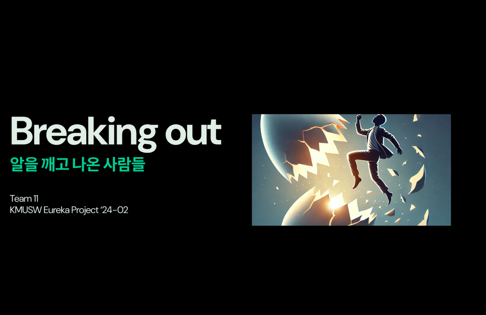
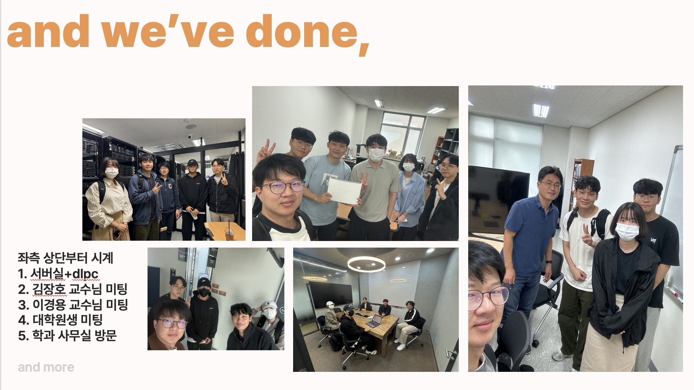
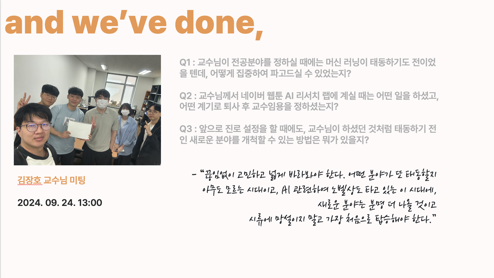
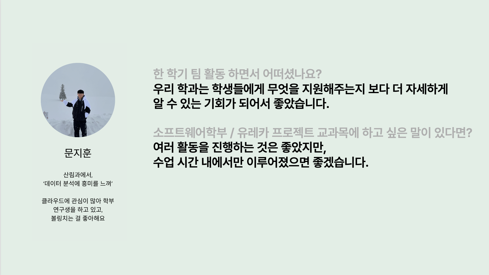
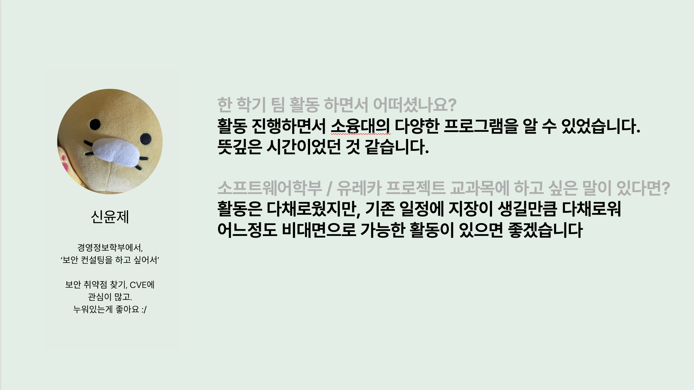
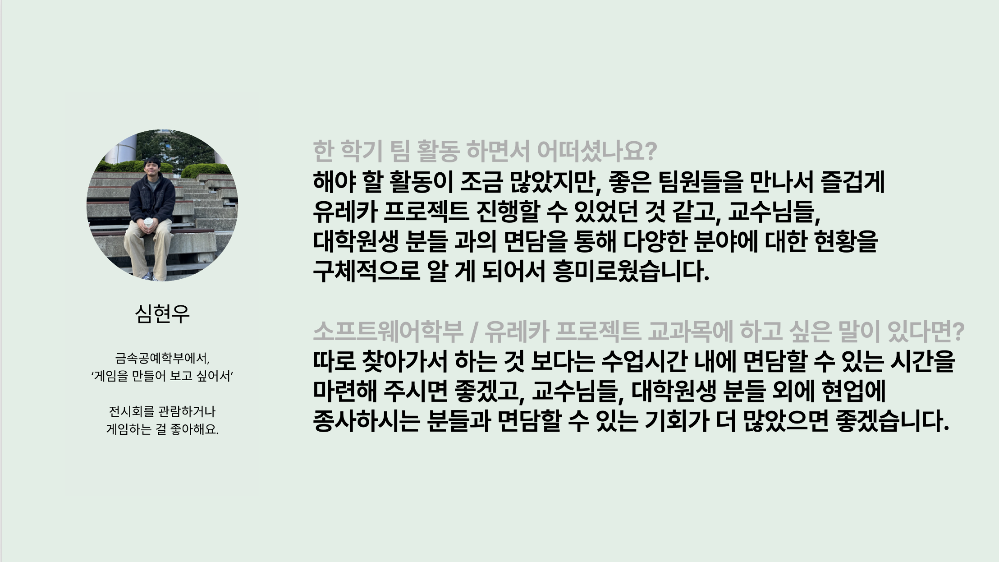
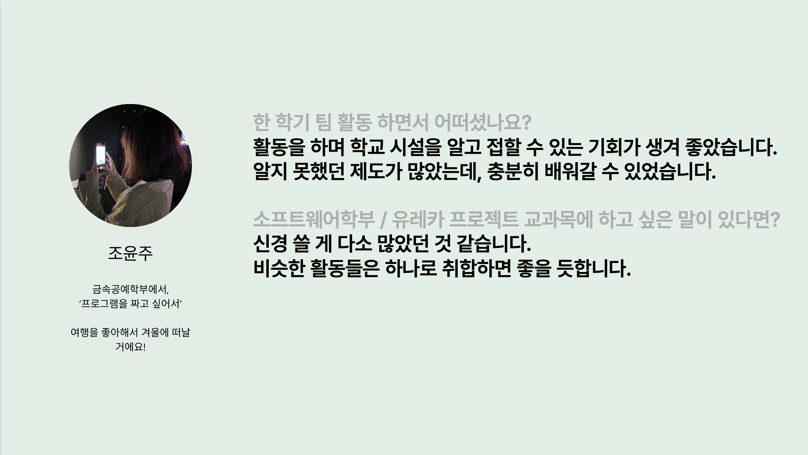
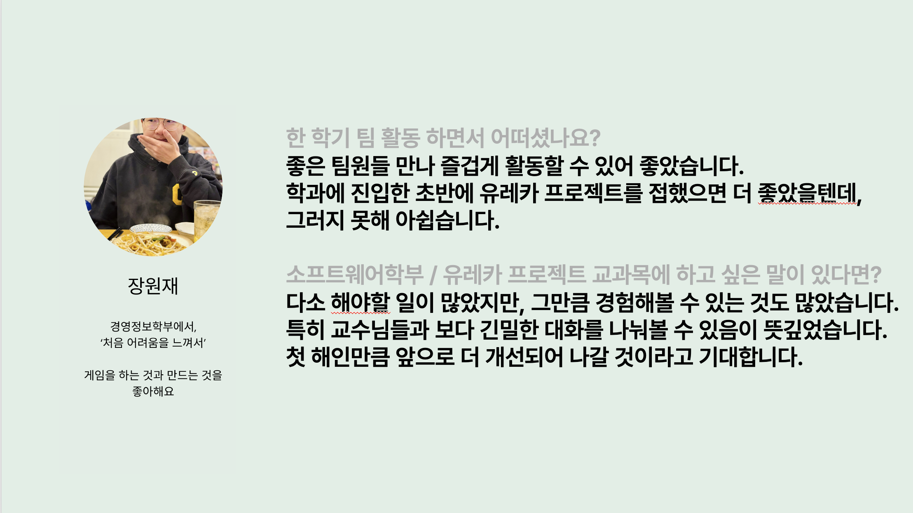

# Hello, we broke out!

국민대학교 소프트웨어융합대학 소프트웨어학부
'24-02학기 유레카프로젝트 1분반 11조입니다.

- 2016**** 장원재
- 2017**** 심현우
- 2022**** 조윤주
- 2022**** 신윤제
- 2021**** 문지훈

## Breaking out

원소속의 테두리를 뛰어넘어 새로운 도전을 위해 소프트웨어학부에 도전하고 있는
전과, 다/부전공 생들의 유레카 프로젝트입니다.

소프트웨어학부를 조금 더 잘 이해하고, 더 수월한 온보딩을 할 수 있는 방법에는 어떤 것이 있을지,
그리고 졸업 후에는 어떤 진로들이 있을지 알아보려 합니다.

## 공통 관심사 / 특이사항
- 전과/복수전공
- 취업 및 진로
- 학부연구생과 대학원 진학

## 활동내역
- 전부 완료!

## 인상깊었던 활동 내역
"사람들이 신기술이라고 부르는 것들은 이미 늦었다, 새로운 분야는 분명 더 나올 것이고 그 흐름을 읽는 안목이 중요하다" - 김장호 교수님과 인터뷰 중

## 발표간 질의응답 내용
질문1
- 질문 내용 : 금속공예에서 전과한 학우들은 전과 전 따로 특별히 한 준비가 있었는지?
- 답변 내용 : 객체지향프로그래밍 과목을 수강했고, 이외에는 학점 기준 3.5를 충족하는 것 말고는 특별한 준비 사항은 없었다.

질문2
- 질문 내용 : 심현우 학우가 게임 개발에 관심이 있다고 했는데, 어떤 게임 만들어봤는지?
- 답변 내용 : 간단한 캐주얼 아케이드 게임들을 개발해보거나, 장원재 학우와 지난 학기 캡스톤 프로젝트 교과목에서 배틀로얄 장르 게임인 VOLTA를 제작한 경험이 있다.

질문3
- 질문 내용 : 장원재 학우가 전과를 결심한 "새롭고 어려움"이 정확히 무슨 의미인지?
- 답변 내용 : 초중고등학교 과정이나 경영대학에서는 어렵다고 느끼는 지식의 습득 과정이 딱히 없었고, 경영대에서도 학문을 습득한다기보다는
인간 사이의 스킬을 배우는 느낌이 강했는데 컴퓨터 프로그래밍 과목을 수강하며 "새롭고 어렵다"는 감정을 느꼈고, 이를 좇기 위해 전과를 결심했다.

and more!
### 팀원들 개개인과 우리가 진행한 활동들에 관심을 가져주는 학우들에게 감사하는 마음이 들었습니다.

## 활동소감 및 각오

# 즐거웠습니다!
